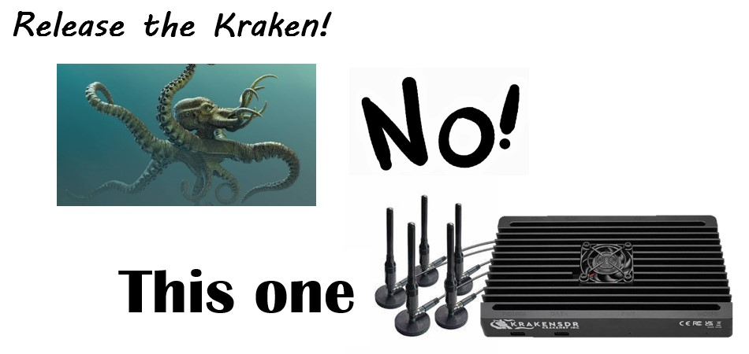

# Bay Area Mesh Network for Emergency Communication

* **Date**: `Nov 3, 2023`
* **Time**: `07:00 PM Pacific Time`
* **Topic**: `Bay Area Mesh Network for Emergency Communication`
* **Presenter**: `Rachel Kinoshita, KK6DAC`

## Details

Come learn about theBay Area Mesh (BAM), a volunteer-led project to build a resilient high-speed wireless network throughout the San Francisco Bay Area for use during disasters and emergencies. The talk will include a demonstration of the mesh network, and information about how you can get involved.
Rachel Kinoshita, KK6DAC, moved from Oregon to the San Francisco Bay Area in 1989 to work for a start-up email software company and has spent most of her career working in the messaging industry.
She now spends her time fighting spam, malware, and phishing attacks. Rachel considers herself still a newbie to ham radio, having only gotten her license in early 2013. Although like many things,
Rachel jumped in with both feet and soon got her general license, an HF rig and starting exploring the world in the low bands. At the same time, she found herself working with her local Community Emergency Response Team (CERT) to help develop and shape their communications plans and policies. She also found her way to the South County ARES (SCARES) organization where she developed an interest in emergency communications.

## Presentation materials

* [Youtube recording](https://youtu.be/9CzbecYhs2A?si=WAkqDxW9DC4n29cv)

<iframe width="560" height="315" src="https://www.youtube.com/embed/9CzbecYhs2A?si=2k66xODg3cOVc34q" title="YouTube video player" frameborder="0" allow="accelerometer; autoplay; clipboard-write; encrypted-media; gyroscope; picture-in-picture; web-share" referrerpolicy="strict-origin-when-cross-origin" allowfullscreen></iframe>



